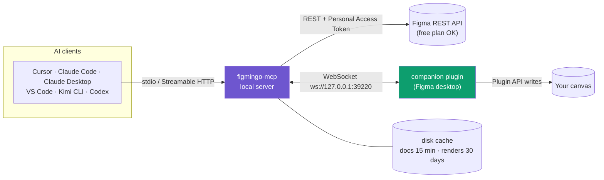
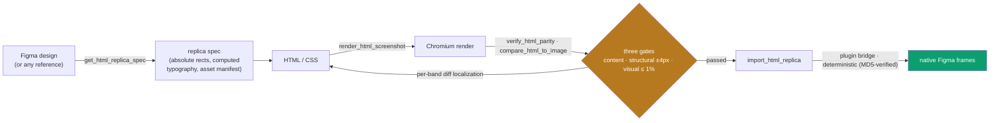
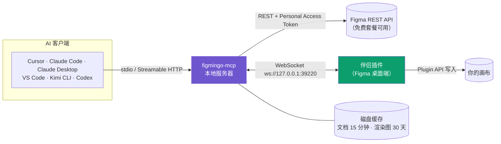
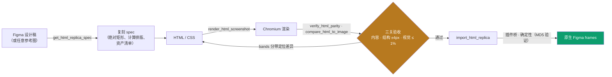

# figmingo-mcp

[](https://www.npmjs.com/package/figmingo-mcp)
[](https://nodejs.org)
[](LICENSE)
[](#development)
[](https://modelcontextprotocol.io)

**Local-first Figma MCP server.** Full read-side parity with the official Figma
MCP on **free** Figma plans (Personal Access Token + public REST API — no seat
quotas, no monthly caps), HTML 1:1 replica tooling with built-in three-gate
acceptance, and write-to-canvas through a companion plugin bridge.

[中文文档 →](#中文文档)

## Architecture



Everything runs on **your machine**: no relay servers, no accounts besides your
own Figma PAT, no data leaves localhost except calls to `api.figma.com`.

## Why figmingo?

| Capability | Official Figma MCP | Framelink (figma-developer-mcp) | figmingo-mcp |
|---|---|---|---|
| Free-plan read quota | ~6 calls/month (Dev seat for more) | unlimited (REST + PAT) | **unlimited (REST + PAT)** |
| Simplified design context | ✅ | ✅ | ✅ (+ absolute bounds, auto-layout, effects) |
| Metadata tree (XML/JSON) | ✅ | partial | ✅ |
| Screenshots (node → png/jpg/svg/pdf) | ✅ | ❌ | ✅ |
| Asset download (nodes + raw image fills) | ✅ | partial | ✅ + manifest |
| Variables / design tokens | ✅ (Enterprise API) | ❌ | ✅ with free-plan fallback (styles + inferred, `source` marked) |
| Design-system search | ✅ | ❌ | ✅ local index |
| Code Connect map | ✅ (server-side) | ❌ | ✅ local `figmingo.components.json` |
| whoami / rate-limit / cache status | ❌ | ❌ | ✅ |
| HTML 1:1 replica spec | ❌ | ❌ | ✅ |
| Playwright HTML screenshots | ❌ | ❌ | ✅ |
| Three-gate parity verifier (content/structural/visual) | ❌ | ❌ | ✅ |
| Write to canvas | ❌ | ❌ | ✅ companion plugin bridge |
| Disk cache (TTL) | ❌ | ❌ | ✅ 15 min docs / 30 days renders |

## Install

One command (macOS / Linux):

```bash
curl -fsSL https://raw.githubusercontent.com/wenym8/figmingo-mcp/main/scripts/install.sh | bash
```

Windows (PowerShell):

```powershell
iwr -useb https://raw.githubusercontent.com/wenym8/figmingo-mcp/main/scripts/install.ps1 | iex
```

The installer checks Node ≥ 18, installs the package, installs the Playwright
Chromium browser (~170MB, one-time — required by the HTML render/extract/compare
tools), writes MCP config into
**Cursor** (`~/.cursor/mcp.json`), **Claude Code** (`~/.claude.json`),
**Claude Desktop**, **VS Code**, **Kimi CLI** (`~/.kimi/mcp.json`), and
**Codex CLI** (`~/.codex/config.toml`, TOML — only the
`[mcp_servers.figmingo]` section is touched; the original is backed up to
`config.toml.figmingo-bak`), copies the companion plugin (manifest + code.js +
ui.html) to `~/.figmingo/plugin`, and prints next steps. Re-running is
idempotent and never wipes a previously configured Figma token.

After installing, run `figmingo-mcp doctor` to verify the whole environment
(Node, Figma token validity, Chromium, plugin files + version drift, client
config entries, bridge port) — every check prints a ✓/✗ with a fix hint, and
the exit code is 0 only when all checks pass.

Manual setup (any client):

```json
{
  "mcpServers": {
    "figmingo": {
      "command": "npx",
      "args": ["-y", "figmingo-mcp"],
      "env": { "FIGMA_API_KEY": "figd_..." }
    }
  }
}
```

- **Kimi CLI** — same JSON shape in `~/.kimi/mcp.json` (merge into `mcpServers`).
- **Codex CLI** — TOML in `~/.codex/config.toml`:

  ```toml
  [mcp_servers.figmingo]
  command = "figmingo-mcp"
  args = []

  [mcp_servers.figmingo.env]
  FIGMA_API_KEY = "figd_..."
  ```

  (omit the `[mcp_servers.figmingo.env]` table if you configure the token
  another way; use `command = "npx"`, `args = ["-y", "figmingo-mcp"]` for a
  zero-install run)

Get a Personal Access Token: **Figma → Settings → Security → Personal access
tokens → Generate new token** (read scopes are enough for the read tools).

## Usage

```bash
figmingo-mcp                      # stdio transport (default, what AI clients use)
figmingo-mcp --http --port 3845   # Streamable HTTP at http://127.0.0.1:3845/mcp
figmingo-mcp cache-clear          # wipe ~/.figmingo/cache
figmingo-mcp --help
```

Flags: `--token <pat>` · `--http` · `--port <n>` · `--bridge-port <n>` ·
`--no-bridge` · `--cache-ttl <min>` · `--cache-root <path>` · `--no-cache`.

## Tools (15)

### Read tools (REST + PAT, free plan OK)

| Tool | What it does |
|---|---|
| `whoami` | Token sanity check (`GET /v1/me`) + rate-limit observations + cache status. |
| `get_design_context` | Simplified node tree: absolute bounds, auto-layout, fills/strokes/effects, text styles. Params: `fileKey`/`url`, `nodeId`, `depth`, `format: json\|compact`. |
| `get_metadata` | Lightweight tree (id/name/type/bounds) as XML (default) or JSON — orient before deep fetches. |
| `get_screenshot` | Node → image via `GET /v1/images/:fileKey`. `scale 0.01–4`, `format png\|jpg\|svg\|pdf`, inline base64 and/or `savePath`. |
| `download_assets` | Batch-export up to N nodes + raw image fills (`GET /v1/files/:key/images`) into a directory; returns a manifest. |
| `get_variable_defs` | Tries `GET /v1/files/:key/variables/local`; on 403 (non-Enterprise) falls back to `GET /v1/files/:key/styles` + tokens inferred from node styles. Output marks `source`. |
| `search_design_system` | Local index over the file's components / component sets / styles; text query + type filter. |
| `get_code_connect_map` | Reads `figmingo.components.json` (user-maintained component→code mapping) and matches a node subtree. |

Every read tool accepts either `fileKey` or a full `url` (the `node-id` query
param is honored).

### Replica tools (the differentiator)

| Tool | What it does |
|---|---|
| `get_html_replica_spec` | Replica-optimized document: sections/elements with **absolute rects**, computed typography (family/style/size/letter-spacing/line-height/text-case), hex+alpha colors, gradient data, and an asset manifest (icons→SVG, image fills→URLs, logo/icon hints via configurable patterns). Writes `<outPath>` and returns a summary. |
| `render_html_screenshot` | Playwright (chromium) screenshot of a URL / local HTML file / raw HTML string; waits for images, optional `hideFixed`, `selector` element captures, full-page default. |
| `verify_html_parity` | The acceptance gate. Renders the HTML, extracts its layout, then runs three gates against the Figma spec: **content** (copy/font/color), **structural** (±4 px position/size), **visual** (pixelmatch diff ratio ≤ 1 %, 2 px crop tolerance). Emits `report.json` + diff images. |
| `compare_html_to_image` | One-shot visual diff: renders the HTML (same Playwright options as `render_html_screenshot`) and pixel-diffs it against any reference image (e.g. a Figma export). `passed = diffRatio <= maxRatio` (default 0.01 = 1 %; raise `maxRatio` for rework/triage loops). Returns diff ratio, anti-alias accounting (`methodology`), and **per-band diff localization** — equal-height `bands: N` or custom `bandEdges: [y…]` (edges win when both are given) so one band can map to one design element. `outDiffPath` saves the red diff PNG, `outRenderPath` saves the render PNG itself. Eliminates the render → hand-written diff script two-step. |

`compare_html_to_image` methodology (also returned in every response):

- **per-pixel threshold**: pixelmatch `threshold` (default `0.1`) decides whether two pixels count as different.
- **anti-alias accounting**: pixelmatch flags anti-aliased pixels; the primary `diffPixels`/`diffRatio` count **excludes** them (`antiAliasCountedInDiff: false`). `antiAliasPixels` is reported separately (derived from a second `includeAA` run) so you can tell "text-edge jitter" apart from real mismatches.
- **pass line**: `passed = diffRatio <= maxRatio`, default `0.01` (1 %). Sizes must match within a 2 px crop tolerance or the call returns `size_mismatch`.

The output schema of `get_html_replica_spec` **is** the input schema of
`verify_html_parity` (`specPath` or inline `spec`) — the closed loop.

Tolerances (ported from production-proven internal tooling):

```
POS_TOL = 4        FONT_SIZE_TOL = 1      LS_TOL = 0.5
LH_TOL  = 2        COLOR_TOL     = 2/255  VISUAL_MAX_RATIO = 0.01 (crop ≤ 2px)
```

Everything brand-specific is parameterized via options:
`skipSections`, `sectionMap`, `expectedCounts` (`{logos, assets, minIcons}`),
`looseRectHints`, `logoPattern`/`iconPattern`, font aliases/overrides.

### Write tools (companion plugin bridge)

| Tool | What it does |
|---|---|
| `bridge_status` | Plugin connected? queue size, client info, supported commands. |
| `execute_plugin_command` | Generic envelope: `create_frame`, `create_text`, `create_rectangle`, `set_fills`, `set_effects`, `set_auto_layout`, `insert_image`, `move_node`, `resize_node`, `delete_node`, `get_selection`, `get_file_info`, `get_page_children`, `export_node` — plus `commands: [...]` batches (sequential, `$var` node-id refs). Queued (bounded) while disconnected; heartbeat-based timeouts (see below). `create_frame`/`create_rectangle` accept `rotation` (degrees); `export_node` accepts `params.outPath` to save bytes to disk. |
| `import_html_replica` | High-level: rebuild a replica spec as native Figma frames — main frame → section frames → nested containers / text / image nodes. Give it an HTML file (`htmlPath`) or URL (`htmlUrl`) and it extracts layout + computed styles with headless Chromium first (border-radius, borders, shadows, gradients, webfonts, real image bytes), or pass a ready-made spec (`spec`/`specPath`). `x`/`y` set the main frame landing spot; `dryRun` previews the command plan; degradations (missing fonts, SVG assets, failed images) come back in `warnings`. |

The companion plugin (`plugin/`) connects to the MCP server at
`ws://127.0.0.1:39220`. Import once: **Figma desktop → Plugins → Development →
Import plugin from manifest…** → select `~/.figmingo/plugin/manifest.json`
(or `plugin/manifest.json` in this repo), then keep it running. Works on free
plans — writes never touch the REST quota.

Architecture note: Figma's plugin sandbox (`code.js`) cannot open WebSockets,
so the socket lives in the plugin's **UI iframe** (`ui.html`) and command
envelopes are relayed between the iframe and the sandbox via `postMessage`
(same architecture as proven local plugins like figwright). The UI shows a
small status panel (● connected / ○ connecting / ✕ failed + reason, server
address, executed-command count) so you can tell at a glance the bridge is
alive. In practice the plugin only talks to your local server; image bytes are
pushed over the socket as base64.

**Batch semantics (`commands: [...]`)**: the plugin executes commands
sequentially and sends a `progress` heartbeat over the socket after **every**
command (success or failure). On the server there is no fixed 30 s hard cap:

- **Idle timeout** (`idleTimeoutMs`, default 20 000): max silence between
  heartbeats/result. Every heartbeat resets it, so a healthy 50-command batch
  never trips it no matter how long it runs.
- **Total cap** (`timeoutMs`, default 300 000 = 5 min): the only hard limit,
  and it's yours to set per call.
- **Partial results**: a batch result always carries a per-command `results`
  array (`{index, command, ok, result|error}`) plus `aborted`/`error` when
  `stopOnError` (default true) cut it short — you see exactly what ran.
- **Timeout errors are atomic-friendly**: if a call still times out, the error
  message lists the command indexes **confirmed applied** via heartbeats
  (e.g. `Confirmed completed command indexes: [0, 1, 2] (3/19)`), so you know
  precisely what the canvas contains before retrying; the plugin may continue
  in the background, so inspect the page (`get_page_children`) first.

Single (non-batch) commands use the same idle/total model.

## Replica Playbook

The closed loop, end to end:



Doing an HTML replica of a Figma design (or any reference screenshot)? Read
[docs/REPLICA-PLAYBOOK.md](docs/REPLICA-PLAYBOOK.md) first — the 6-step battle
flow distilled from six scored replica rounds (measure-before-CSS, font lock-in,
bandEdges-driven iteration, single-variable changes, convergence criteria), diff
image reading, tool cheat sheet, and the copy-proofing checklist. It exists so
your next replica converges in 3–4 rounds instead of 7.

## Free-plan availability

| Surface | Free plan |
|---|---|
| All read tools | ✅ PAT + public REST; per-minute rate limits only (auto-backoff on 429) |
| `get_variable_defs` | ✅ via fallback (`source: styles+inferred`); raw `variables/local` is Enterprise-only and returns 403 |
| Write tools | ✅ plugin API has no plan gating |
| MCP client support | ✅ any MCP-capable client (the official Figma desktop MCP is plan-gated; this server is not) |

## Acceptance (验收)

Battle-tested on six scored replica challenges (independent judge agents,
re-measured from scratch — no self-reported numbers):

| Challenge | Score | Pixel diff | Notes |
|---|---|---|---|
| C1 Korean travel infographic | 91 | 2.46 % | PASS |
| C2 Baidu homepage | 93 | 1.96 % | PASS |
| C3 Kimi settings modal | 93 | 0.51 % | PASS |
| C4 FAQ accordion (3 states) | 93 | 0.46–0.58 % | PASS |
| C5 Music player (image → HTML → Figma) | 92 | 0.87 % | PASS, 30-node MD5-deterministic import |
| C6 SaaS landing page (1440×4148, 7 sections) | 84 | 0.58 % | PASS, 279-node one-shot import, zero manual patches, MD5-verified reproducible |

```bash
npm install
npm run build
npm test            # 176 unit tests (vitest) with recorded fixtures

# live acceptance against the real API:
FIGMA_API_KEY=<pat> TEST_FILE_KEY=<file-key> [TEST_NODE_ID=1:2] npm run accept
```

`npm run accept` walks every tool and prints a ✅ / ⏭️ / ❌ checklist. It exits
gracefully with guidance when the token/file key is missing; write tools report
**SKIP** (not FAIL) when the companion plugin isn't connected.

## Development

```bash
npm run build         # tsup (dist/) + tsc (plugin/code.js)
npm run typecheck     # strict tsc --noEmit
npm test              # vitest
npm run accept        # live acceptance checklist
```

Repo layout: see [ARCHITECTURE.md](ARCHITECTURE.md) — it is the authoritative
spec for the tool list, REST facts, caching, bridge protocol, and the
acceptance plan.

## License

[MIT](LICENSE)

---

## 中文文档

**本地优先的 Figma MCP 服务器**：免费 Figma 套餐也能跑全部读取能力（Personal Access Token + 公开 REST API，无席位配额、无月度上限）；HTML 1:1 复刻工具链（内置三关验收）；通过伴侣插件桥把内容写回画布。

### 架构



一切都在**你自己的机器**上运行：没有中转服务器，除了调用 `api.figma.com`，数据不出本机。

### 与其他方案对比

| 能力 | 官方 Figma MCP | Framelink (figma-developer-mcp) | figmingo-mcp |
|---|---|---|---|
| 免费套餐读取配额 | 约 6 次/月（更多需 Dev 席位） | 无限（REST + PAT） | **无限（REST + PAT）** |
| 精简设计上下文 | ✅ | ✅ | ✅（+ 绝对坐标、auto-layout、效果） |
| 元数据树（XML/JSON） | ✅ | 部分 | ✅ |
| 截图（节点 → png/jpg/svg/pdf） | ✅ | ❌ | ✅ |
| 资产下载（节点 + 原始图片填充） | ✅ | 部分 | ✅ + 清单 |
| Variables / 设计 tokens | ✅（Enterprise API） | ❌ | ✅ 免费套餐降级方案（styles + 推导，标 `source`） |
| 设计系统搜索 | ✅ | ❌ | ✅ 本地索引 |
| Code Connect 映射 | ✅（服务端） | ❌ | ✅ 本地 `figmingo.components.json` |
| whoami / 限流 / 缓存状态 | ❌ | ❌ | ✅ |
| HTML 1:1 复刻 spec | ❌ | ❌ | ✅ |
| Playwright HTML 截图 | ❌ | ❌ | ✅ |
| 三关验收（内容/结构/视觉） | ❌ | ❌ | ✅ |
| 写回画布 | ❌ | ❌ | ✅ 伴侣插件桥 |
| 磁盘缓存（TTL） | ❌ | ❌ | ✅ 文档 15 分钟 / 渲染图 30 天 |

### 安装

一条命令（macOS / Linux）：

```bash
curl -fsSL https://raw.githubusercontent.com/wenym8/figmingo-mcp/main/scripts/install.sh | bash
```

Windows（PowerShell）：

```powershell
iwr -useb https://raw.githubusercontent.com/wenym8/figmingo-mcp/main/scripts/install.ps1 | iex
```

安装器会：检测 Node ≥ 18 → 全局安装包 → 安装 Playwright Chromium（约 170MB，一次性，HTML 渲染/提取/对比工具需要）→ 写入 **Cursor**（`~/.cursor/mcp.json`）、**Claude Code**（`~/.claude.json`）、**Claude Desktop**、**VS Code**、**Kimi CLI**（`~/.kimi/mcp.json`）、**Codex CLI**（`~/.codex/config.toml`，TOML，只改 `[mcp_servers.figmingo]` 段，原文件备份为 `config.toml.figmingo-bak`）的 MCP 配置 → 把伴侣插件（manifest + code.js + ui.html）复制到 `~/.figmingo/plugin` → 打印后续指引。重复运行幂等，不会清掉已配置的 Figma token。

装完运行 `figmingo-mcp doctor` 自检整个环境（Node、token 有效性、Chromium、插件文件与版本漂移、客户端配置项、桥端口）——每项打印 ✓/✗ 并附修复提示，全部通过时退出码才为 0。

手动配置（任意客户端）：

```json
{
  "mcpServers": {
    "figmingo": {
      "command": "npx",
      "args": ["-y", "figmingo-mcp"],
      "env": { "FIGMA_API_KEY": "figd_..." }
    }
  }
}
```

获取 PAT：**Figma → 设置 → 安全 → Personal access tokens → 生成新 token**（读工具只需读权限）。

### 用法

```bash
figmingo-mcp                      # stdio 传输（默认，AI 客户端用这个）
figmingo-mcp --http --port 3845   # Streamable HTTP：http://127.0.0.1:3845/mcp
figmingo-mcp cache-clear          # 清空 ~/.figmingo/cache
figmingo-mcp doctor               # 环境自检
figmingo-mcp --help
```

### 15 个工具

**读取工具（REST + PAT，免费套餐可用）**：`whoami`（token 自检 + 限流/缓存状态）· `get_design_context`（精简节点树：绝对坐标、auto-layout、填充/描边/效果、文字样式）· `get_metadata`（轻量树，XML/JSON，深取前先定位）· `get_screenshot`（节点渲染图，scale 0.01–4，png/jpg/svg/pdf）· `download_assets`（批量导出节点 + 原始图片填充，带清单）· `get_variable_defs`（variables 接口 403 时降级 styles + 推导 tokens，标 `source`）· `search_design_system`（本地索引查组件/样式）· `get_code_connect_map`（组件→代码映射）。

所有读取工具都接受 `fileKey` 或完整 `url`（自动解析 `node-id`）。

**复刻工具（差异化能力）**：`get_html_replica_spec`（复刻专用文档：绝对矩形、计算后的字体排版、hex+alpha 颜色、渐变、资产清单）· `render_html_screenshot`（Playwright 截图 URL/本地 HTML/HTML 字符串）· `verify_html_parity`（验收闸门：内容关文案/字体/颜色、结构关 ±4px、视觉关像素 diff ≤ 1%，产出 `report.json` + diff 图）· `compare_html_to_image`（一键视觉 diff，bands 分带定位差异，AA 像素单独记账）。

容差（生产验证过的内部工具移植）：

```
POS_TOL = 4        FONT_SIZE_TOL = 1      LS_TOL = 0.5
LH_TOL  = 2        COLOR_TOL     = 2/255  VISUAL_MAX_RATIO = 0.01（裁切 ≤ 2px）
```

**写入工具（伴侣插件桥）**：`bridge_status`（桥连接状态）· `execute_plugin_command`（14 种命令 + `commands: [...]` 批次，顺序执行，`$var` 节点引用，心跳超时机制）· `import_html_replica`（HTML 文件/URL 一键直导为原生 Figma frames，Chromium 提取布局与计算样式，`dryRun` 预览，降级进 `warnings`）。

插件连接 `ws://127.0.0.1:39220`。导入一次：**Figma 桌面端 → 插件 → 开发 → Import plugin from manifest…** → 选 `~/.figmingo/plugin/manifest.json`，保持运行即可。免费套餐可用——写入不占用 REST 配额。

架构说明：Figma 插件沙箱（code.js）无法开 WebSocket，所以连接由插件的 **UI iframe**（ui.html）持有，命令经 `postMessage` 在 iframe 与沙箱间转发。UI 有状态面板（● 已连接 / ○ 连接中 / ✕ 失败原因、服务器地址、已执行命令数）。

**批次语义**：插件顺序执行，每条命令（无论成败）后都发 `progress` 心跳。服务器没有 30s 硬顶：**空闲超时**（`idleTimeoutMs`，默认 20s，心跳即重置）+ **总上限**（`timeoutMs`，默认 5 分钟，可每次调用自设）。批次结果带逐命令 `results` 数组；超时错误会列出**已确认落画布的命令索引**，重试前先用 `get_page_children` 看画布现状。

### 复刻闭环



做 HTML 复刻先读 [docs/REPLICA-PLAYBOOK.md](docs/REPLICA-PLAYBOOK.md)——六轮带评分实战沉淀的 6 步流程（先量后写 CSS、字体锁定、bandEdges 驱动迭代、单变量改动、收敛判据）、diff 图读法、工具速查表、防抄漏清单。让你的下一次复刻 3–4 轮收敛，而不是 7 轮。

### 免费套餐可用性

| 能力 | 免费套餐 |
|---|---|
| 全部读取工具 | ✅ PAT + 公开 REST；仅有每分钟限流（429 自动退避） |
| `get_variable_defs` | ✅ 降级方案（`source: styles+inferred`）；原始 variables 接口是 Enterprise 限定，返回 403 |
| 写入工具 | ✅ 插件 API 无套餐门槛 |
| MCP 客户端 | ✅ 任意支持 MCP 的客户端（官方 Figma 桌面 MCP 有套餐门槛，本服务器没有） |

### 验收

六轮带评分的复刻挑战实测（独立 judge agent 从零复测，非自报数据）：

| 题目 | 分数 | 像素 diff | 备注 |
|---|---|---|---|
| C1 韩国攻略信息图 | 91 | 2.46 % | PASS |
| C2 百度首页 | 93 | 1.96 % | PASS |
| C3 Kimi 设置弹窗 | 93 | 0.51 % | PASS |
| C4 FAQ 手风琴（3 状态） | 93 | 0.46–0.58 % | PASS |
| C5 音乐播放器（图片 → HTML → Figma） | 92 | 0.87 % | PASS，30 节点导入 MD5 确定性 |
| C6 SaaS 落地页（1440×4148，7 个 section） | 84 | 0.58 % | PASS，279 节点一键直导、零手工补丁、MD5 可复现 |

```bash
npm install
npm run build
npm test            # 176 个单元测试（vitest，录制 fixtures）

# 真实 API 验收：
FIGMA_API_KEY=<pat> TEST_FILE_KEY=<file-key> [TEST_NODE_ID=1:2] npm run accept
```

`npm run accept` 逐个工具打 ✅ / ⏭️ / ❌；token/fileKey 缺失时优雅退出并给指引；插件未连接时写工具报 **SKIP**（不是 FAIL）。

### 开发

```bash
npm run build         # tsup（dist/）+ tsc（plugin/code.js）
npm run typecheck     # 严格 tsc --noEmit
npm test              # vitest
npm run accept        # 真实 API 验收清单
```

仓库结构见 [ARCHITECTURE.md](ARCHITECTURE.md)——工具清单、REST 事实、缓存、桥协议、验收方案的权威文档。

### License

[MIT](LICENSE)
